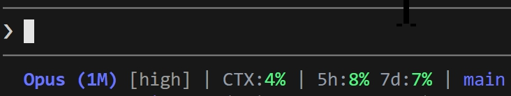

# claude-statusline

Rust で書いた Claude Code 用のシンプルなカスタム statusline。

## 表示内容

| セクション | 内容 |
|-----------|------|
| モデル名 | 短縮名 + コンテキストサイズ (例: `Opus (1M)`) |
| effort | `settings.json` の `effortLevel` を DIM 表示 |
| CTX | コンテキストウィンドウ使用率 |
| 5h / 7d | レートリミット使用率 (5時間 / 7日) |
| ブランチ | 現在の Git ブランチ名 |

使用率は色で段階表示: 🟢 < 50% / 🟡 < 80% / 🔴 >= 80%

## インストール

この README を Claude Code に読み込ませて「このstatuslineをインストールして」と伝えるだけです。

## 要件

- Rust 1.70+
- Claude Code
